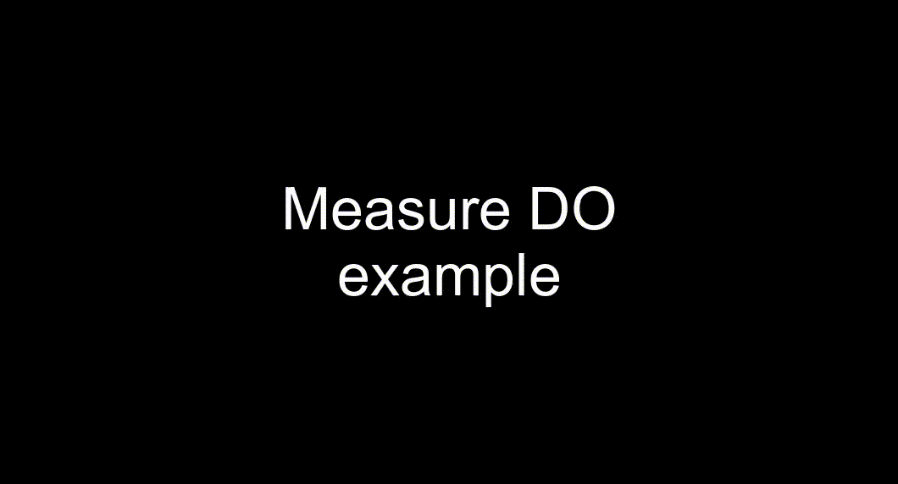
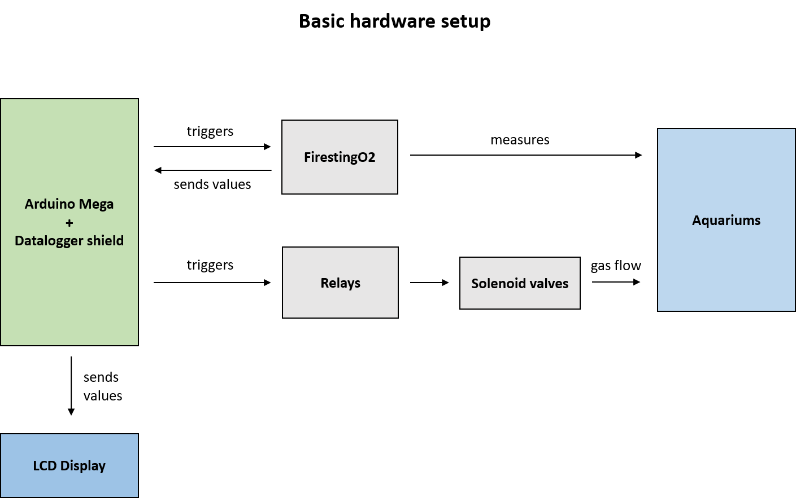

# ArdOxy
An Arduino library for interfacing with PyroScience FireSting oxygen meters.

## Use Cases
* measurement and logging of dissolved oxygen (DO) concentration and temperature without a computer
* automated control of DO concentration via solenoid valves or mass-flow controller
* establishment of pre-defined DO regime in fish tanks
* long-term acclimation to controlled DO conditions

## Project Status
This project is under development. 

## Table of Contents
* [Installation](#installation)
  * [Example 1](#example-1-measure_DO)
  * [Example 2](#example-2-measure_and_plot)
* [Background](#background)
* [Basic Setup](#basic-setup)
  * [List of Materials](#list-of-materials)
  * [Details](#details)
    * [Oxygen Sensor](#oxygen-sensor)
    * [Computing Component](#computing-component)
    * [Gas Flow Control](#gas-flow-control)
      * [Solenoid Valves](#solenoid-valves)
      * [Mass-Flow Controllers](#mass-flow-controllers)
  * [Overview](#overview)
* [Oxygen Control V1](#oxygen-control-v1)
  * [The Code](#the-code)

## Installation
Clone or download this repository and extract the "Ardoxy" folder to the library directory of your Arduino IDE (Windows default: documents>>Arduino>>libraries).
Start the Arduino IDE and select one of the examples from "File>>Examples>>Ardoxy".

### Example 1: measure_DO
This example simply triggers a DO measurement in an adjustable interval and prints the measurement status (1 if successful, 0 if no connection, 9 if communication mismatch) along with the measurement result to the serial monitor (I'd recommend the default serial monitor of the Arduino IDE).

### Example 2: measure_and_plot
This example sketch sends temperature and DO measurements via serial to the PC. To plot these values, [download SerialPlot](https://hackaday.io/project/5334-serialplot-realtime-plotting-software) and load the settings file from this repo ([link](./SerialPlotter%20config%20measure%20and%20plot.ini). This great piece of software allows you to send commands (to trigger the start of measurements) and to visualize and log values.

## Background
Oxygen is a limited but essential resource for aquatic life. In many ecosystems, dissolved oxygen fluctuates and can reach critically low concentrations - a condition called hypoxia. Fish that have evolved under the pressure of aquatic hypoxia have developed many adaptations, ranging from behavioral strategies and morphology (-> gills!) to biochemical and physiological adjustments. These adaptations secure their survival under hypoxic conditions. For the research of these adaptations, it is advantageous if one can reproduce long term hypoxia (as it occurs naturally) in the lab.

A simple way to reproduce hypoxic conditions is to bubble nitrogen gas into water. The nitrogen displaces dissolved oxygen but remains otherwise inert - it does not react with the water. Hypoxic conditions, however, need to be closely monitored and controlled. Thus, periodic measurements and adjustments of oxygen levels are mandatory to create safe and reproducible conditions.

This project aims to create the basis for an open and reproducible oxygen control system on which interested researchers and afficionados can improve and develop their own systems. It is part of my PhD research on the behavior and physiology of weakly electric fish and I'm not a pro when it comes to pneumatic, kybernetics and electrotechnics (actually, I learned everything that I needed over the course of a couple of months). This means that
1. This system can still be improved
2. You can build it, even if you didn't go through an education in technical kybernetics

Here are the minimal requirements that I wanted to fulfill with this system:
* long-term measurement and logging of dissolved oxygen and temperature
* reproducible control of dissolved oxygen via nitrogen influx
* open and reproducible design
* affordability

## Basic Setup
*All components here are listed for reproduction purposes and not as advertisement!*

### List of Materials
These are the core components of the oxygen measurement and control system. For details, see below
* Oxygen sensor: PyroScience FireStingO2
* Logging, computation, control: Arduino Mega
* Gas flow control: Solenoid valves or Mass-flow controllers

### Details
#### Oxygen Sensor
As this system is intended for long-term use, it relies on optical oxygen sensors. Optical sensors constitute the most expensive component - they are much more expensive than the relatively cheap electrochemical oxygen electrodes (such as [silver-platinum electrodes](https://en.wikipedia.org/wiki/Clark_electrode)). However, electrochemical sensors have a strong drift due to the deposition of salts on the anode and are thus not suited for long-term use without regularly being re-calibrated.
After a ton of research (there are many manufacturers of optical oxygen sensors out there), I decided for the 4-channel FireStingO2 sensor from PyroScience for the following reasons:

* 4 channel measurement on one device
* Serial communication via 3.3V-5V UART (-> compatible with microcontroller)
* usable as stand-alone sensor for DO logging in other experiments
* supported by excellent and free software like [AquaResp](http://www.aquaresp.com/) and the [respR package](https://januarharianto.github.io/respR/index.html) for R

#### Computing Component
This covers the measurement-side. Now for logging the values and actively controlling the oxygen we could have a PC (1000$) hooked to the sensors with a custom-written Matlab/LabView ($ license) and a lab-grade DAQ (400-1000$) to generate control outputs but that would mean we use a sledge-hammer to crack a nut and skyrocket the total cost of the system. By the way, it would violate my wish for it to be as open as possible.

Luckily, the FireStingO2 can be addressed via 3.3-5V serial communication - a language that most microcontrollers speak natively!
This means, instead of heavy equipment, we can use an arduino (or any clone) to "talk to" the sensor - *perfect!* The arduino is particularly suited for this because:
* it's cheap and open!
* it can be equipped with an LCD display, an SD card and a real time clock
* there's a great community and many libraries such as the PID library

#### Gas Flow Control
##### Solenoid Valves
Now what's still open is the pneumatic mechanism and control algorithm to bubble nitrogen into fish tanks. The obvious solution for this are solenoid valves - they're cheap and easy to control. The downside here is that simple solenoid valves work in a binary way - open and close. There's no ramping up the stream of gas that passes through, there's only bubble and stop. For my setup, I use these simple valves because you can get a decent one for about 30$. To control for the effect of bursts of bubbles (such as stress) and time change, I included 8 additional valves that bubble air into control tanks.

If you want a more sophisticated system, I suggest you check out *servo-assisted solenoid valves* (open/close dynamics depend on the pressure of the gas) or *proportional solenoid valves* (open/close dynamic can be controlled more finely) - they're more likely around 100-150$ a piece though. 

My valves run on 24V, that means, they receive voltage, they open. This can be easily controlled via relays that are controlled by the arduino. Now, we only need the actual heart-piece of the whole control-system: a control algorithm. 
For this, I use one of the available and excellent [PID libraries](https://playground.arduino.cc/Code/PIDLibrary/) for the arduino. PID stands for proportional-integral-derivative and what it does, in short, is to keep track of control outputs and their effect in order to optimize the control output. 
An example helps to understand why we can't do without this: If you want to decrease the oxygen concentration from, say, 70% air saturation to 60% air saturation, a relatively short burst of nitrogen will do because at these concentrations, oxygen will only slowly diffuse back into the water. If you try to reach the same 10% decrease at lower air saturations, let's say from 20% to 10%, you'll need considerably more nitrogen gas. Why? Because now, there's a steep concentration gradient between the low oxygen concentration in the water and the comparably high concentration in the surrounding air. Thus, oxygen will constantly diffuse into the water and you have to actively drive it out. A PID control  "notices" that the same output of nitrogen leads to different outcomes and thus will increase the output at low air saturations. As we work with simple open/close valves, I let the PID controller calculate a time window for opening the valves. 

##### Mass-Flow Controllers
Mass-flow controllers (MFCs) are the first and obvious choice to control gas flow. Why aren't they used in the first iteration of this system? Because they're quite expensive!!

However, we have some old MKS mass-flow controllers lying around here. They need a +- 15V power supply and can be controlled with an analog 0-5V input. First tests with these MFCs are very promising and I will supply more information on how to control DO with Ardoxy and MFCs in the future

### Overview

As mentioned above, the arduino sends to and receives from the sensor via its serial port. The relays are triggered via digital outputs and all is powered by separate power supplies. Also, as this remains untested at the moment, the temperature sensors are not included in this overview

## Oxygen Control V1
This system was tested in an 8-week hypoxia acclimation experiment. It is designed to measure and control DO in eight tanks. The sketch is now in the "old_sketches" directory
Here's a list of the components of the last tested configuration for an 8-channel system:
* 1 Arduino MEGA 2560
* 1 Adafruit Datalogger Shield (ID1141)
* 1 Adafruit LCD display (ID714)
* 2 FireStingO2 4 channel oxygen sensors + robust DO probes
* 2 Sainsmart 8-channel relays
* 16 24V burkert 6011 solenoid valves (8 for nitrogen and 8 for air)
* A lot of cable, gas tubes and push-in fittings

### The Code
*Update: the sketches for multichannel- and long-term hypoxia acclimation have been moved to the "old_sketches" folder. Newer sketches will use the functions from the Ardoxy library*

*To edit and upload the sketches to an arduino, you need the [arduino IDE](https://www.arduino.cc/en/main/software)*.

